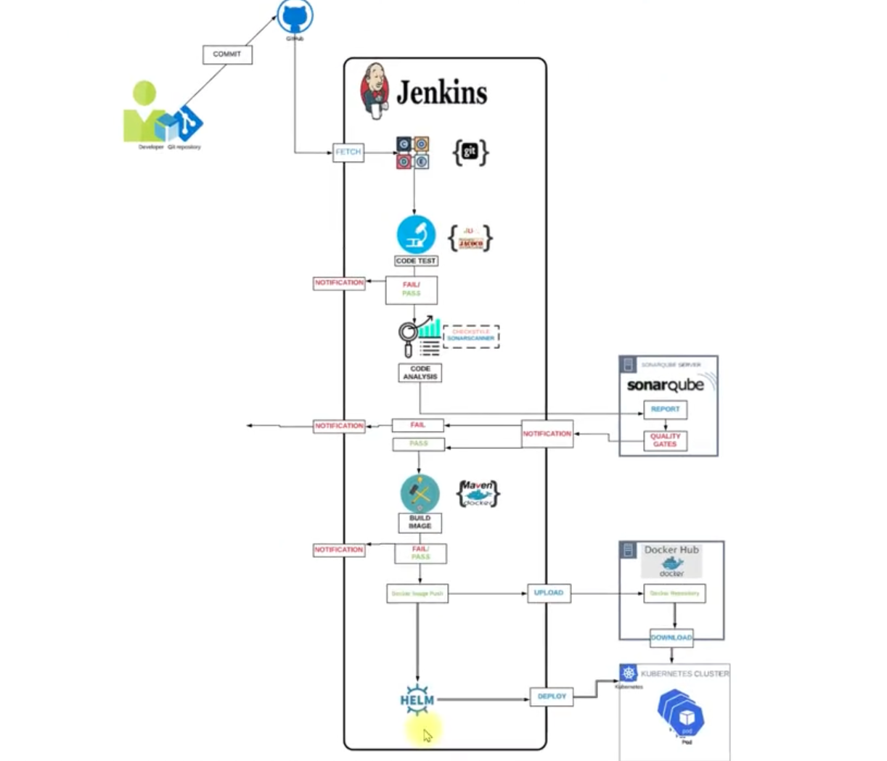

# Continuous Delivery for Docker Containers

## Scenario

### Current Situation

I was working with:

- **Microservices Architecture** of an Application
- **Containerized Application**
- **Continuous Code Changes**

My workflow involved:

- **Continuous Build & Test**
- **Regular Build of Container Images**
- **Regular Deployment Requests to Ops Team**

## Problem

I identified several critical issues:

- **Operation team incharge of Managing containers Gets continuous Deployment Requests**
- **Manual Deployment creates dependency**
- **Time Consuming**

## Solution

I implemented a comprehensive fix:

1. **Automate Build & Release process**
2. **Build Docker Images & Deploy Continuously as fast as the Code commits**

## My CI/CD Pipeline Architecture

I designed a comprehensive CI/CD pipeline that automates the entire process from code commit to deployment. Here's how my pipeline works:

### Pipeline Flow

1. **Code Commit**: I commit code to my Git repository, which triggers the automated pipeline
2. **Code Fetch**: Jenkins fetches the latest code from GitHub
3. **Code Test**: The code undergoes testing with JUnit - if it fails, I receive a notification
4. **Code Analysis**: If tests pass, SonarQube performs code analysis and quality checks
5. **Build Image**: Maven builds the Docker image - if it fails, I receive a notification
6. **Push to Registry**: The Docker image is pushed to Docker Hub
7. **Deploy**: Helm deploys the application to the Kubernetes cluster

### Key Components

- **GitHub**: My source code repository
- **Jenkins**: My CI/CD automation server
- **SonarQube**: My code quality analysis server
- **Maven**: My build automation tool
- **Docker Hub**: My container registry
- **Helm**: My Kubernetes package manager
- **Kubernetes**: My container orchestration platform

## Flow of Execution

I followed a systematic approach to set up my Continuous Delivery pipeline. Here are the steps I executed:

### Initial Setup (Steps 1-7)

1. **Continuous Integration Setup**: I configured Jenkins, SonarQube, and Nexus for my Continuous Integration Project
2. **Dockerhub Account**: I created and set up my Dockerhub account for the Containerization Project
3. **Store Dockerhub Credentials in Jenkins**: I securely stored my Dockerhub credentials within Jenkins
4. **Setup Docker Engine in Jenkins**: I configured the Docker Engine within my Jenkins environment
5. **Install Plugins in Jenkins**: I installed specific plugins in Jenkins:
   - Docker-pipeline
   - Docker
   - Pipeline utility
6. **Create Kubernetes Cluster with Kops**: I set up my Kubernetes Cluster using Kops
7. **Install Helm in Kops VM**: I installed Helm within my Kops Virtual Machine

### Chart and Testing Setup (Steps 8-9)

8. **Create Helm Charts**: I created Helm charts for my application deployment
9. **Test Charts in K8s Cluster in test namespace**: I tested my charts in the Kubernetes cluster within the test namespace

### Pipeline Implementation (Steps 10-14)

10. **Add Kops VM as Jenkins Slave**: I configured my Kops VM to function as a Jenkins agent
11. **Create Pipeline Code [Declarative]**: I wrote my Jenkins Pipeline script using Declarative syntax
12. **Update Git Repository with**:
    - **a. Helm Charts**: I added Helm charts that define, install, and upgrade my applications on Kubernetes
    - **b. Dockerfile**: I created Dockerfiles with instructions for building Docker images
    - **c. Jenkinsfile (Pipeline code)**: I added the Jenkins Pipeline definition to my repository
13. **Create Jenkins Job for Pipeline**: I set up a new job within Jenkins configured to execute my pipeline
14. **Run & Test the Job**: I executed the Jenkins job and verified its functionality

## Tools I Used

### **Kubernetes** - Orchestration tool
I used Kubernetes to manage and orchestrate my containerized applications across clusters.

### **Docker** - Container Runtime
I used Docker as my container runtime to build, package, and run my applications in isolated containers.

### **Jenkins** - CI/CD Server
I implemented Jenkins as my CI/CD server to automate my entire build, test, and deployment pipeline.

### **Docker Hub** - Container Registry
I utilized Docker Hub as my container registry to store, manage, and version my Docker images.

### **Helm** - Packaging & Deploying on Kubernetes
I used Helm for packaging and deploying my applications on Kubernetes, streamlining complex deployments.

### **Git** - Version Control System
I used Git as my version control system to track changes and manage different versions of my application.

### **Maven** - Build Tool
I leveraged Maven as my build tool to manage my project's build lifecycle and dependencies.

### **SonarQube** - Code Analysis Server
I integrated SonarQube as my code analysis server to maintain code quality and security through static analysis.